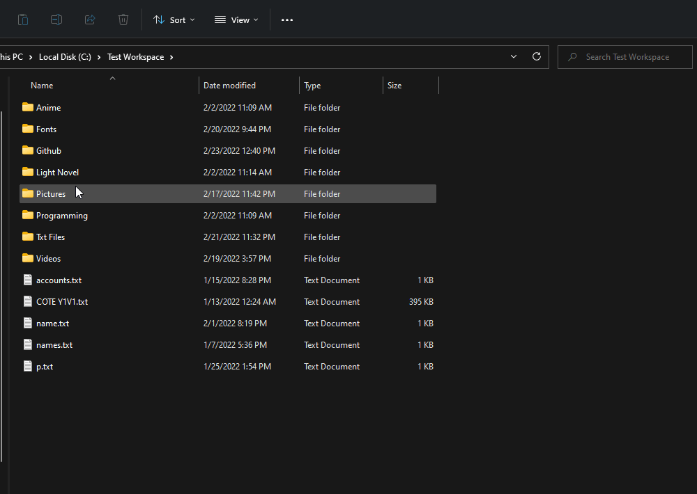

#  Smart Organizer

Smart Organizer is an application that aims to improve your overall desktop/workspace tidiness, by allowing you to set a variety of **Rules**.

## Demo:

## Personal Usecases: 
  - Removing unwanted files.
  - Sorting Light Novel Books, Coding Books.
  - Moving school documents into appropriate folders.
  - Moving anime episodes into correct folder.
  - Cleaning unused environment directories or project folders like venv folders, node_modules and rust target folders etc.

## How does it work?
This app is uses quite a bit of jargons, namely:
- **Listener** - This is the term given to the component that sends the signal to the rust backend to organize on a defined interval.
- **Rule** - A rule is a condition a file or path must follow in order to carry out an **Action**. Definition:
```ts
interface Rule {
  search_type: "Folder Name" | "File Name" | "File Extension" | "File Content" | "FileSize" | "Path Name",
  condition: "Includes" | "Not Includes" | "Exact Match" | "Is Not",
  text: string // text being the value to match
}
```
- **Action** - A tuple consisting of the action to perform as well as optionally a destination respectively. Definition:
```ts
type ActionType = "MOVE" | "COPY" | "DELETE" | "UNLINK" | "RENAME";

type Action = [ActionType, string];

```
A **Rule** is provided and in accordance to that rule, if files/directories match in the specified path an **Action** is performed. The option of scanning a directory of depth 1 or recursively is also made possible.
## Major changes from prerelease
 - More modern UI.
 - More readable codebase.
 - Tree browser moved from clicking listener to dedicated button in listener's modal.
 - Listener's modal opens on a single click instead of double.

## Upcoming 
- Empty States
- Refactor rust backend 
- MacOs like titlebar and more...
